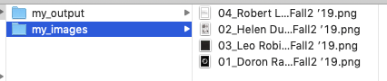
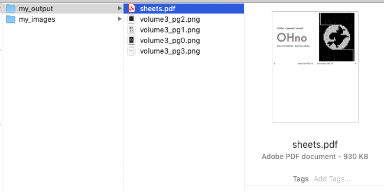
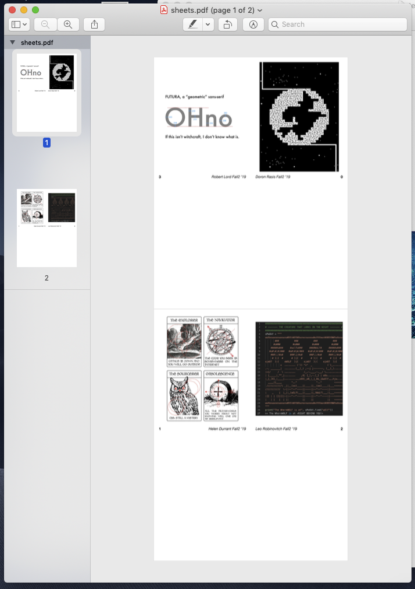

#RC Zine Formatter!
Custom zine formatter for the [RC Zine](https://zine.recurse.com). Given a folder of content images, this script generates a PDF layout for printing and individual PNGs for each page of content. Each page is a quarter sheet of A4 printer paper with the appropriate page number and image title in the footer, as well as the image content scaled to the body of the page.
##Example:
Given a folder of input images: 
Running the following code:
```
$ python3 format_pages.py -i my_images -o my_output -f volume3_pg{}.png
```
Will generate the following files in `my_output`:  